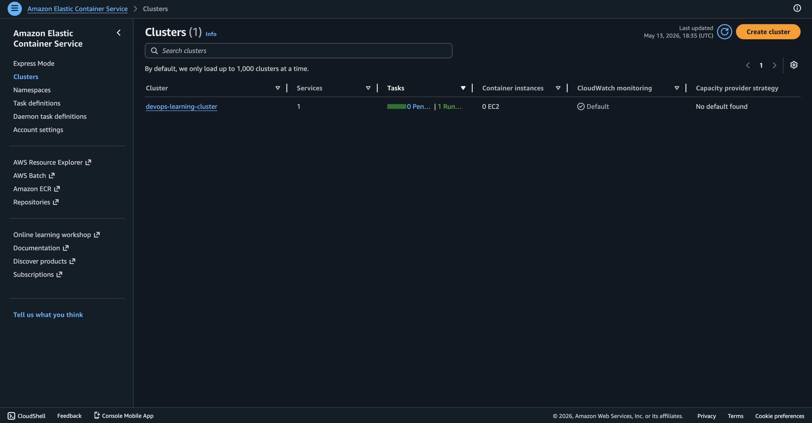
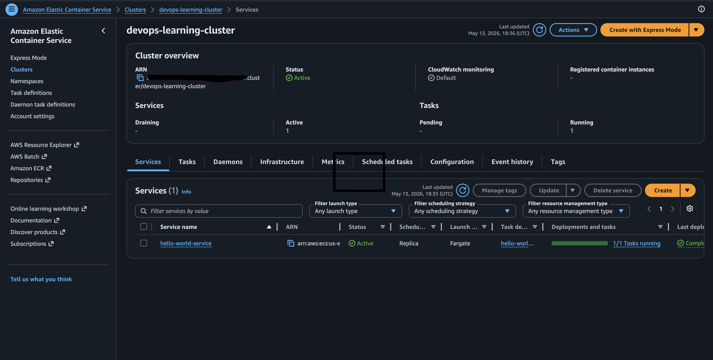
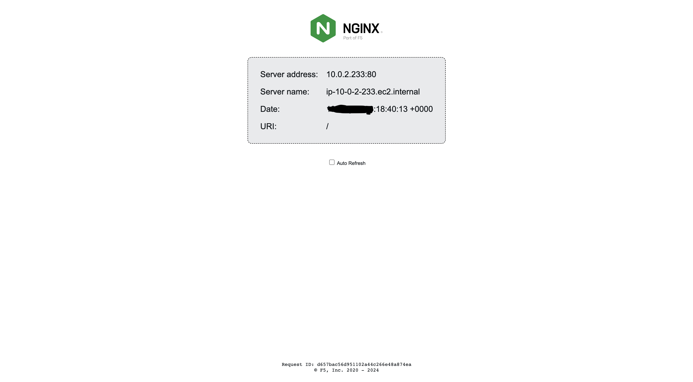

# Secure AWS ECS Deployment via GitHub Actions OIDC

Automated infrastructure deployment pipeline for AWS ECS using Terraform with GitHub Actions OIDC authentication.

---

## Quick Start (5 Minutes)

### Prerequisites

- AWS Account with appropriate IAM permissions
- Terraform installed locally (`>= 1.2`)
- GitHub repository with admin access
- AWS CLI configured with credentials

### Setup Steps

1. **Create S3 bucket for Terraform state:**

   ```bash
   aws s3 mb s3://my-unique-devops-project-state-storage --region us-east-1
   ```

2. **Deploy OIDC & IAM role locally:**

   ```bash
   terraform apply
   ```

   This creates the GitHub Actions trust relationship and the deployment role.

3. **Add GitHub Environment variables** (`dev` environment):
   - `PROJECT_NAME` = devops-learning
   - `PROJECT_ENV` = dev
   - `VPC_CIDR` = 10.0.0.0/16
   - `AVAILABILITY_ZONES` = ["us-east-1a", "us-east-1b"]
   - `PUBLIC_SUBNETS` = ["10.0.1.0/24", "10.0.2.0/24"]
   - `CONTAINER_IMAGE` = nginxdemos/hello
   - `APP_PORT` = 80

4. **Push to main branch:**
   ```bash
   git push origin main
   ```
   GitHub Actions automatically deploys your infrastructure.

---

## Architecture Overview

### OpenID Connect (OIDC)

- **What:** GitHub proves its identity to AWS using temporary JWT tokens instead of static credentials.
- **Why:** More secure—no long-lived keys to rotate; tokens expire immediately after the job.

### Terraform State Management

- **What:** Infrastructure state stored in an S3 backend.
- **Why:** Prevents conflicts between local and CI/CD deployments; keeps state synchronized.

---

## File Structure

| File                           | Purpose                                          |
| ------------------------------ | ------------------------------------------------ |
| `oidc.tf`                      | Defines OIDC provider, IAM role, and permissions |
| `provider.tf`                  | AWS & TLS provider configuration                 |
| `main.tf`                      | VPC, ECS cluster, task definition, and service   |
| `variables.tf`                 | Input variable definitions                       |
| `terraform.tfvars`             | Default variable values                          |
| `terraform.tf`                 | Terraform version & backend configuration        |
| `.github/workflows/deploy.yml` | CI/CD pipeline workflow                          |

---

## Deployment Workflow

1. **Trigger:** Push to `main` branch
2. **OIDC Auth:** GitHub assumes the IAM role via OIDC token
3. **Terraform Init:** Initializes S3 backend
4. **Terraform Plan:** Reviews infrastructure changes
5. **Terraform Apply:** Deploys resources automatically

---

## Troubleshooting & Common Issues

### Issue: `403 Access Denied` (AssumeRoleWithWebIdentity)

**Causes:**

- Incorrect OIDC thumbprints
- Case-sensitivity mismatch in repository name (e.g., `DennisOtchere` vs `dennisotchere`)

**Solution:**

- Verify thumbprints: `6938fd4d98bab03faadb97b34396831e3780aea1` and `1c58a3a8518e8759bf075b76b750d4f2df264fcd`
- Ensure `sub` condition in IAM Trust Policy matches exact repository owner case: `repo:DennisOtchere/terraform-ecs-deployment:environment:dev`

### Issue: `failed to get shared config profile, engineer`

**Cause:** Hardcoded AWS profile in `provider.tf` not available in CI/CD environment.

**Solution:**

- Remove `profile = "engineer"` from `provider.tf`
- CI/CD uses environment variables automatically
- Local development: `export AWS_PROFILE=engineer` before running Terraform

### Issue: `invalid CIDR address: "10.0.0.0/16"`

**Cause:** Variable values wrapped in quotes in GitHub UI (e.g., `"10.0.0.0/16"` instead of `10.0.0.0/16`).

**Solution:**

- Remove quotes from GitHub Secrets/Variables UI—GitHub treats them as strings automatically
- Paste raw values only

### Issue: `terraform plan` hangs indefinitely

**Cause:** Missing Terraform variable causing Terraform to wait for user input.

**Solution:**

- Always use `-input=false` in CI/CD: `terraform plan -input=false`
- Verify all `TF_VAR_*` environment variables are mapped correctly in `deploy.yml`
- Check variable naming: e.g., `TF_VAR_public_subnets` (not `public_subnet_cidrs`)

### Issue: Missing IAM Permissions for State Refresh

**Cause:** IAM role can create resources but cannot read them (missing `iam:GetRole`, `iam:GetOpenIDConnectProvider`).

**Solution:**

- Expand IAM Role Policy to include `iam:Get*` and `iam:List*` actions
- Terraform needs read permissions to refresh state before planning

### Issue: Local Terraform fails with credential error

**Cause:** `AWS_PROFILE` environment variable set to non-existent profile (e.g., `[engineer]` not in `~/.aws/credentials`).

**Solution:**

```bash
unset AWS_PROFILE
```

Terraform falls back to default credentials.

---

## Essential Commands

| Command                         | Purpose                                                 |
| ------------------------------- | ------------------------------------------------------- |
| `terraform init -reconfigure`   | Reinitialize backend (switch providers/credentials)     |
| `terraform plan -input=false`   | Preview changes without user input (required for CI/CD) |
| `terraform apply -auto-approve` | Deploy without confirmation (used in CI/CD)             |
| `terraform destroy`             | Tear down all infrastructure                            |
| `aws sts get-caller-identity`   | Verify current AWS credentials & account                |
| `unset AWS_PROFILE`             | Clear AWS profile to use default credentials            |

---

## Key Implementation Details

### IAM Trust Policy (Case-Sensitive)

The OIDC trust relationship requires exact case matching:

```hcl
"token.actions.githubusercontent.com:sub" = "repo:DennisOtchere/terraform-ecs-deployment:environment:dev"
```

Repository owner name must match GitHub profile case exactly.

### GitHub Actions Workflow Permissions

```yaml
permissions:
  id-token: write # Required for OIDC JWT token
  contents: read # Required for git checkout
```

### Terraform Variable Mapping

GitHub environment variables are mapped to Terraform using `TF_VAR_` prefix:

```yaml
env:
  TF_VAR_vpc_cidr: ${{vars.VPC_CIDR}}
  TF_VAR_public_subnets: ${{vars.PUBLIC_SUBNETS}}
```

### Screenshots


